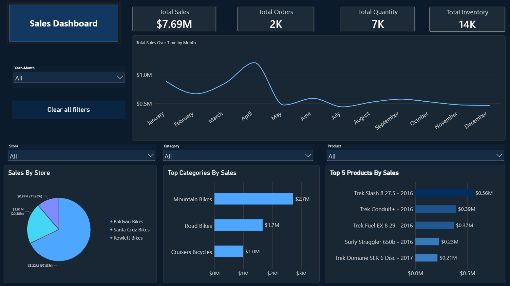
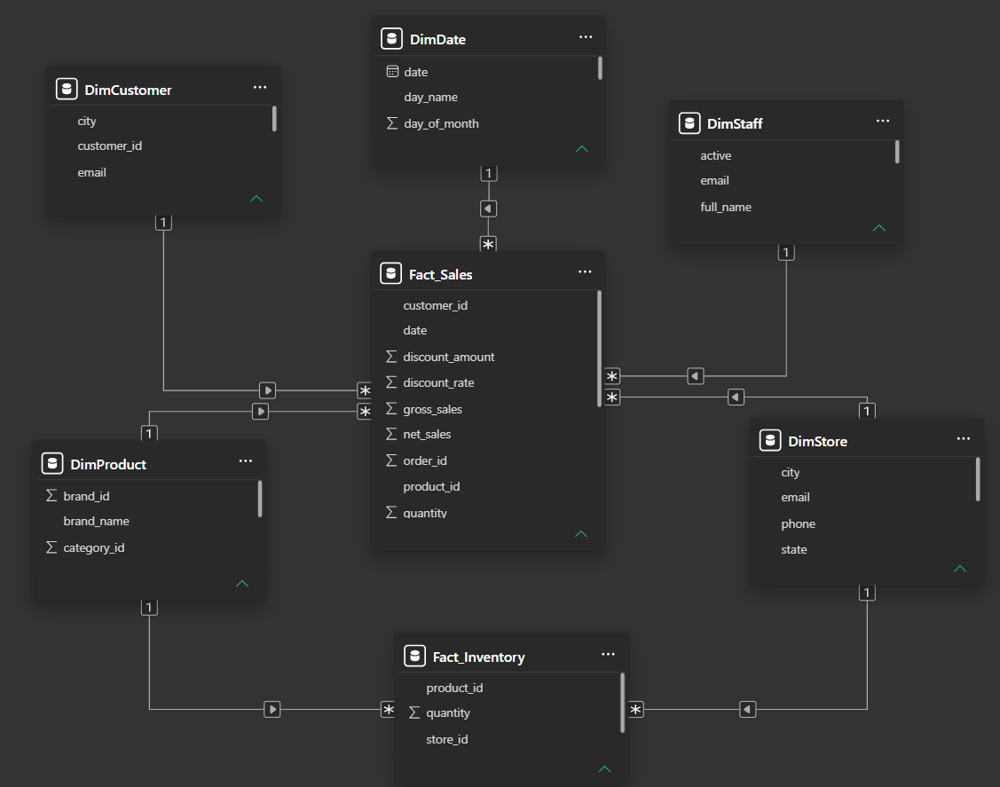
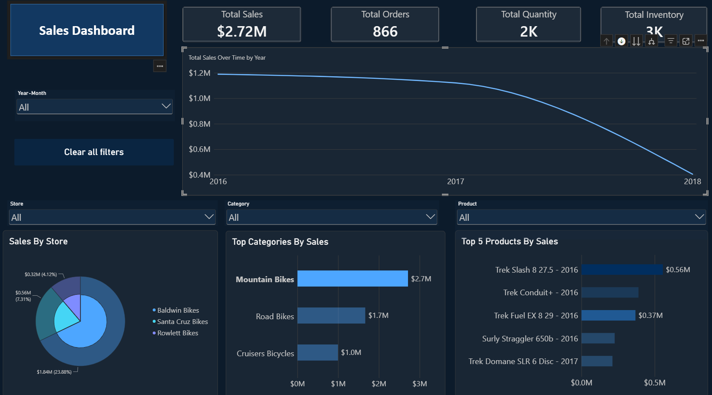

# Bikes Sales Dashboard

The dashboard includes important KPIs such as: total sales/revenue, total units sold, inventory quantity, top-selling products,...

This dashboard can be used to track sales performance over time[year/month/week]. User can also filter data by [Region, Product, Category, Date] to identify for example which products generate the most sales, which categories perform best, where are sales performing poorly, inventory quantity of the best sales product,...

## Data Overview

*Datasource: 
`BikeStores Sample Database (2017)` provided by SQLServerTutorial.net*

| Table | number of records | action
|--------|-------------|-------------|
| `categories` | 7 | |
| `brands` | 9 |       
| `stores` | 3 | create `DimStores` |
| `customers` | 1445 | create `DimCustomer`|
| `[products]` | 321 | create DimProduct joining products with `brands` table and `categories` table|
| `[stock]` | 939|    | create `FactInventory` table |
| `[staffs]` | 10|    | create `DimStaff` joining staffs with `stores` tables |
| `[orders]` | 1600|    |
| `[order_items]` | 4722| create `FactSales` table using `INNER JOIN` with `orders` and other `DimTables`, calculate `gross_sales`, `net_sales` after `discount` |

- I created `DimDate` ranging from 01/01/2016 - 28/12/2018 which is `min_date` and `max_date` from `[order_items]`

*Data quality check:*

- Only one staff is not assigned to a manager
- After aggregating, the table is unchanged so the data was already aggregated
- Every records are VALID by `JOINING` tables. For example I verified whether every order has a valid customer, every order item has a valid order, every order item has a valid product
- In the customers database, the input are standardized. first_name and last_name have the first capital letter, phone numbers are standardized to the format (XXX) XXX-XXXX, and email addresses are converted to lowercase.
- In the products database, product names are standardized to have the first letter of each word capitalized.
- In the orders database, order dates are standardized to the format YYYY-MM-DD.
- In the order_items database, list prices and discounts are standardized to two decimal places.

Overall, the database is well-organized and I do not need to transform the data itself.

Then I tried some queries for example: Which products generate the highest gross and net sales using `GROUP BY` and `ORDER BY`, how does discount % impact sales ? using `CASE WHEN` to categorize discount_tier and calculate `gross_sales` and `net_sales`.

The tables work well and ready for visualization.

## Star Schema
 

## Measures
Create `Total Orders`, `Total Quantity`, `Total Sales`, `Total Inventory`  using `DAX` functions `DISTINCTCOUNT`, `SUM`

## Techniques and Charts
- KPI, line chart, cluster bar chart, pie chart.
- Filter, slicer

| Insights | Action |
|---|---|
| Good sales performance in Quarter 1 and Quarter 2 of the Year, highest in April | high demand time, focus on marketing and operational planning |
| 2018 has the lowest revenue | Check which drives to low sales (out of stock, pricing strategies, sales channel, competitors, alternative product) |
| Mountain Bikes sales drops down dramatically in 2018 | Check which drives to low sales |

